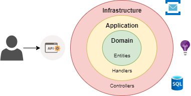

# Architecture

Different ways but domain always at the center.

```
📦: Project (or solution)
📂: Directory inside project
📜: C# class
```

## Hexagonal 🧠

<p align="center"> 
    
 </p>

```
 📦Contoso.API
 ┣ 📦Application
 ┃ ┣ 📂Features
 ┃ ┃ ┣ 📂AddInvoice
 ┃ ┃ ┃ ┣ 📜Handler
 ┃ ┃ ┃ ┣ 📜Request
 ┃ ┃ ┃ ┗ 📜Response
 ┃ ┃ ┗ 📁GetInvoice
 ┃ ┗ 📂Services
 ┃ ┃ ┣ 📜IInvoiceQueries
 ┃ ┃ ┗ 📜IInvoiceRepository
 ┣ 📦Domain
 ┃ ┗ 📂Entities
 ┃ ┃ ┗ 📜Invoice
 ┗ 📦Infrastructure
   ┣ 📂API
   ┃ ┣ 📂Models
   ┃ ┃ ┗ 📜AddInvoiceModel
   ┃ ┗ 📜ContosoController
   ┣ 📂Database
   ┃ ┣ 📜InvoiceQueries
   ┃ ┗ 📜InvoiceRepository
   ┗ 📂Messaging
     ┣ 📂Messages
     ┃ ┗ 📜AddInvoiceMessage
     ┗ 📜ContosoHandler
```
  
## Simple version 😴

In this version we don't have API models, we use application models to transfer data to controller and to application handlers. Controllers are at the top of each feature. It is still important to keep domain and application separate from infrastructure. Note that in this solution everything is within the same assembly.

```
 📦Contoso.API
 ┣ 📂Entities
 ┃ ┗ 📜Invoice
 ┣ 📂Features
 ┃ ┗ 📂Invoices
 ┃ ┃ ┣ 📜Controller
 ┃ ┃ ┣ 📂AddInvoice
 ┃ ┃ ┃ ┣ 📜Handler
 ┃ ┃ ┃ ┣ 📜Request
 ┃ ┃ ┃ ┗ 📜Response
 ┃ ┃ ┗ 📁GetInvoice
 ┣ 📂Infrastructure
 ┃ ┗ 📂Database
 ┃ ┃ ┣ 📜InvoiceQueries
 ┃ ┃ ┗ 📜InvoiceRepository
 ┗ 📂Services
   ┣ 📜IInvoiceQueries
   ┗ 📜IInvoiceRepository
 ```

This architecture can be good to start a project and if the project grows go to the other solution.