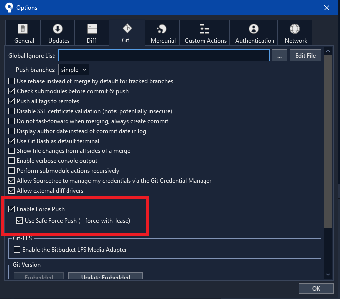
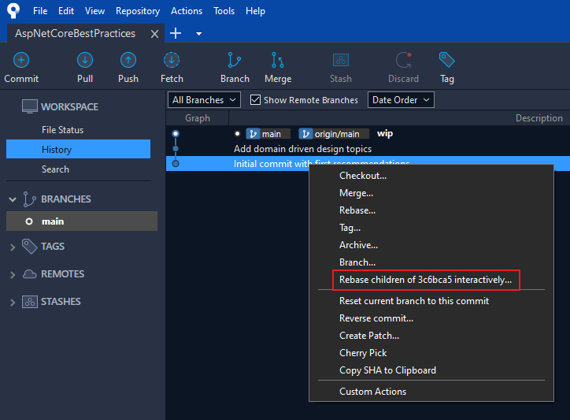
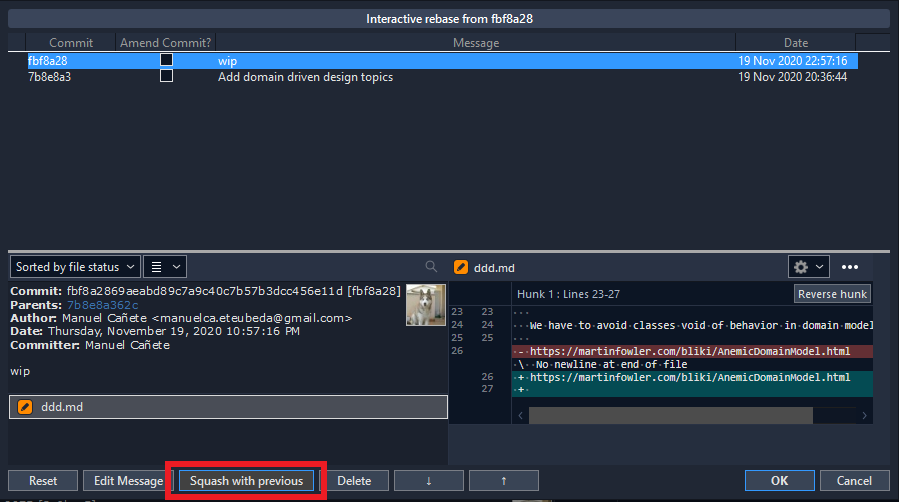
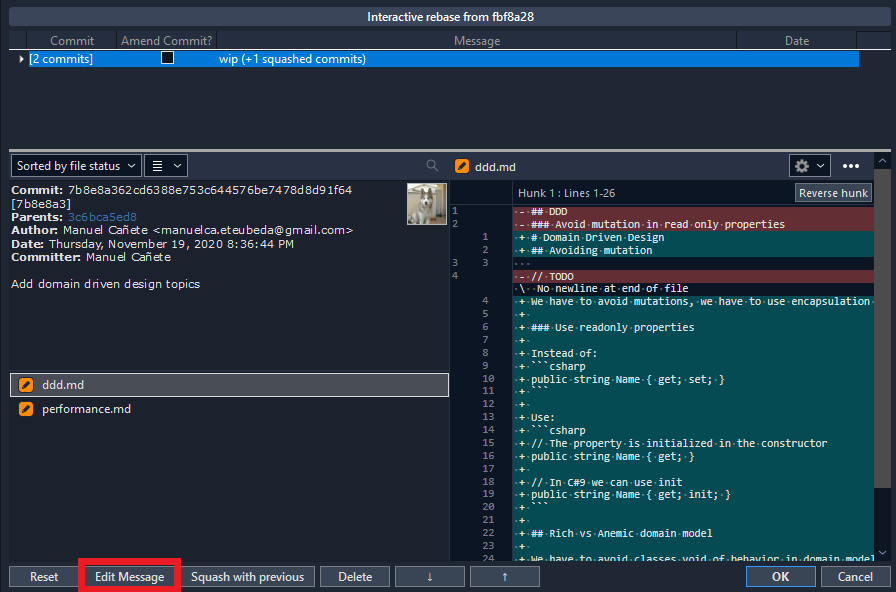
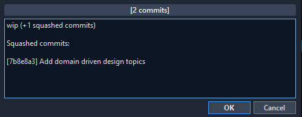
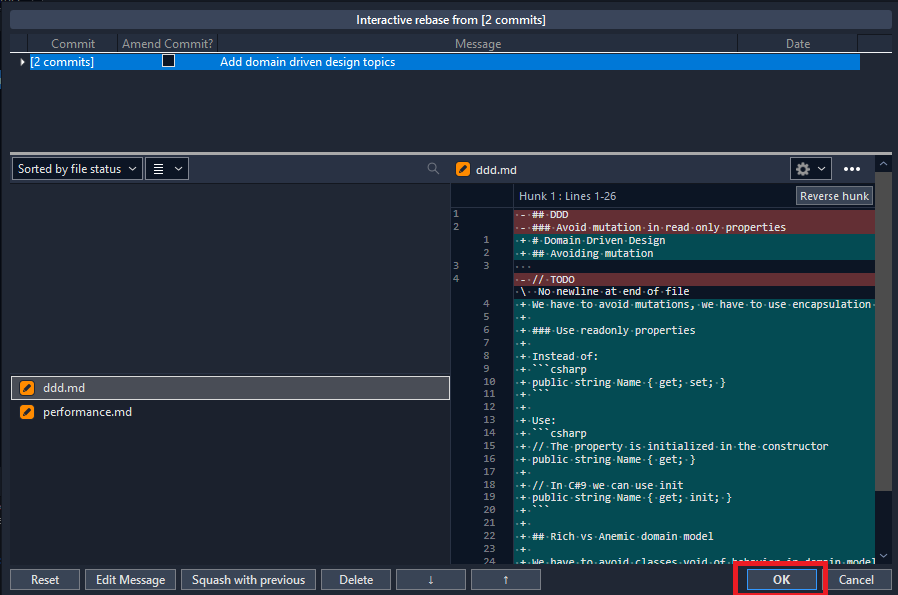
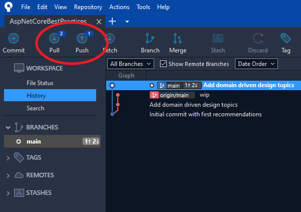
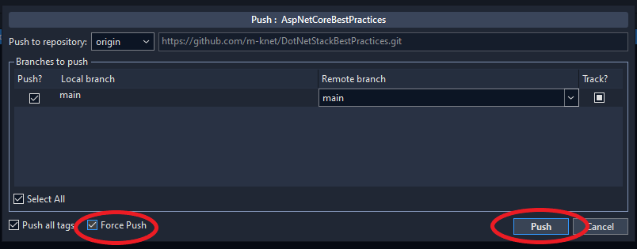
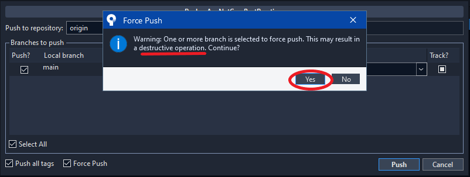

# Git

- Squash commits before push
- Rebase instead of merge
- One line to describe the commit, details two lines above
- Specify user story id (or track id used) like #2212

Example:

```git
Add user profile

Enable feature flag in configuration
User story #2212 
```

## Squash commits with interactive rebase - SourceTree

This is the most effective way in SourceTree to squash our commits. All we need to do is follow the steps below.

0. Squashing commits is a destructive operation in the branch and we need to force push. This option is disabled by default but can be enabled in `Tools -> Options -> Git`.

    

1. Click the right mouse button in the previous commit and select interactive rebase.

    

2. Select the last commit and click in squash with previous until there is only one.

    

3. When there is only one commit, the commit message can be changed for a more descriptive one:

    
    
    

4. Commits are already squashed. Now the process finish clicking in the `Ok` button.

    

5. Then, there are 2 commits to pull and one to push... why? It is because we have previous commits in the origin and the new squashed one in local. We click in the `Push` button.

    

6. And to finish squash select `Force Push` and click in the `Push` button. In the dialog select `Yes` (see step 0).

    
    